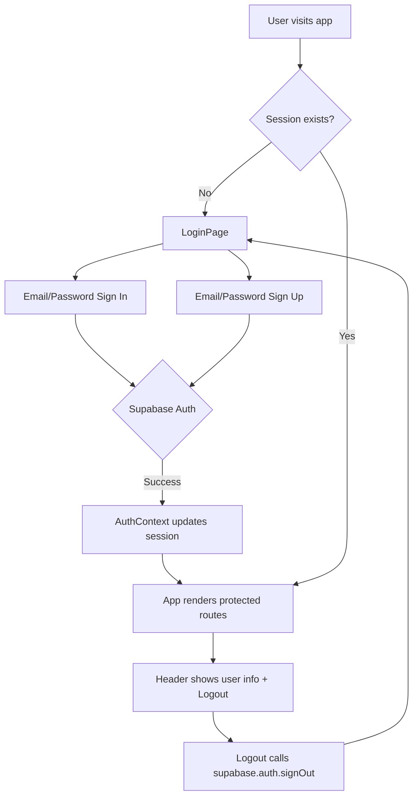
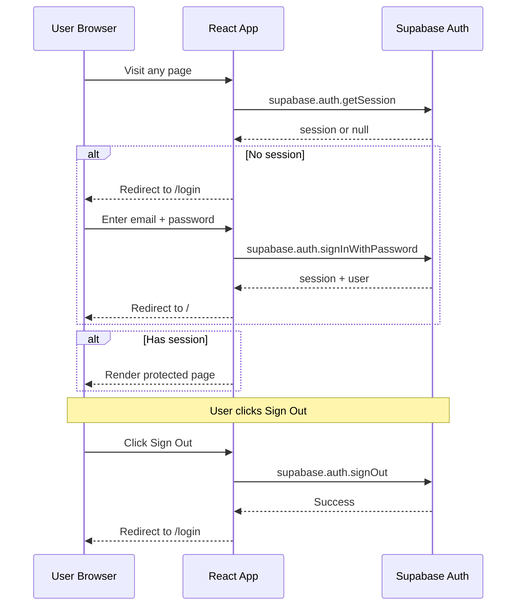

# Supabase Auth Integration Plan — DAO Watch Automation

## Overview

Integrate Supabase Auth into the existing DAO Watch Automation React (CRA) + Express app to add a login gate. All auth tables already exist in the **CryptoSI** Supabase project (`rfcwtdadbecxmndgndge`), so no Supabase-side changes are needed.

**Supabase Project Details:**
- **Project URL:** `https://rfcwtdadbecxmndgndge.supabase.co`
- **Region:** eu-west-1
- **Status:** ACTIVE_HEALTHY

---

## Architecture



---

## New Files to Create

### 1. `client/src/lib/supabase.js` — Supabase Client

Initializes the `@supabase/supabase-js` client using environment variables. Uses `localStorage` for session persistence (default for SPA).

```js
import { createClient } from '@supabase/supabase-js';

const supabaseUrl = process.env.REACT_APP_SUPABASE_URL;
const supabaseAnonKey = process.env.REACT_APP_SUPABASE_ANON_KEY;

export const supabase = createClient(supabaseUrl, supabaseAnonKey);
```

### 2. `client/src/context/AuthContext.js` — Auth Context Provider

A React context that:
- Calls `supabase.auth.getSession()` on mount to restore existing sessions
- Subscribes to `supabase.auth.onAuthStateChange()` for real-time session updates
- Exposes `session`, `user`, and `signOut` to all child components

### 3. `client/src/pages/LoginPage.js` — Login / Sign Up Page

A styled login page matching the existing Tailwind design with:
- Email + password sign-in form
- Email + password sign-up form (toggle between modes)
- Error message display
- Loading states
- Redirect to home on successful auth

### 4. `client/src/components/ProtectedRoute.js` — Route Guard

A wrapper component that:
- Checks if a session exists via `AuthContext`
- If not authenticated, redirects to `/login` using `<Navigate>` from react-router-dom
- If authenticated, renders the child route via `<Outlet />`

---

## Files to Modify

### 5. `client/src/index.js` — Router Configuration

Wrap the app in `AuthProvider` and restructure routes:

```
/ (App layout)
├── /login (LoginPage) — public
└── (ProtectedRoute wrapper)
    ├── / (HomePage)
    ├── /submit (SubmitProposalPage)
    ├── /review (ReviewDataPage)
    ├── /history (HistoryPage)
    └── /markdown-viewer (MarkdownViewerPage)
```

### 6. `client/src/components/Header.js` — User Menu

Add to the header:
- Show user email when logged in
- Add a Sign Out button that calls `supabase.auth.signOut()`
- Conditionally hide nav items when not logged in (though ProtectedRoute handles this)

### 7. `client/.env` — Environment Variables

Create with:
```
REACT_APP_SUPABASE_URL=https://rfcwtdadbecxmndgndge.supabase.co
REACT_APP_SUPABASE_ANON_KEY=<anon_key>
```

### 8. `.env.example` and `server/.env.example`

Add Supabase env var placeholders for documentation.

---

## Dependency to Install

```bash
cd client && npm install @supabase/supabase-js
```

---

## Auth Flow Diagram



---

## Key Design Decisions

1. **Client-side only auth** — Since this is a CRA SPA, auth is handled entirely on the client using `@supabase/supabase-js`. The server API routes remain unprotected for now (they serve local data, not Supabase data).

2. **Email/Password auth** — Using Supabase's built-in email/password provider. No OAuth social login initially.

3. **Session persistence** — Uses `localStorage` (the Supabase JS client default for browser apps). Sessions survive page refreshes.

4. **No server-side changes** — The Express server continues to serve API routes as before. If server-side route protection is needed later, the client can send the Supabase access token in an `Authorization` header and the server can verify it.

5. **No Supabase database changes** — The auth tables already exist. No migrations needed.

---

## Implementation Order

1. Install `@supabase/supabase-js`
2. Create `client/src/lib/supabase.js`
3. Create `client/src/context/AuthContext.js`
4. Create `client/src/pages/LoginPage.js`
5. Create `client/src/components/ProtectedRoute.js`
6. Update `client/src/index.js` with AuthProvider and protected routes
7. Update `client/src/components/Header.js` with user info and sign out
8. Create `client/.env` with Supabase credentials
9. Update `.env.example` files
